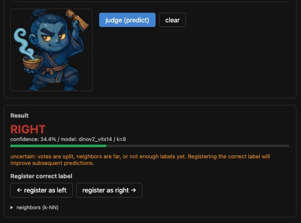
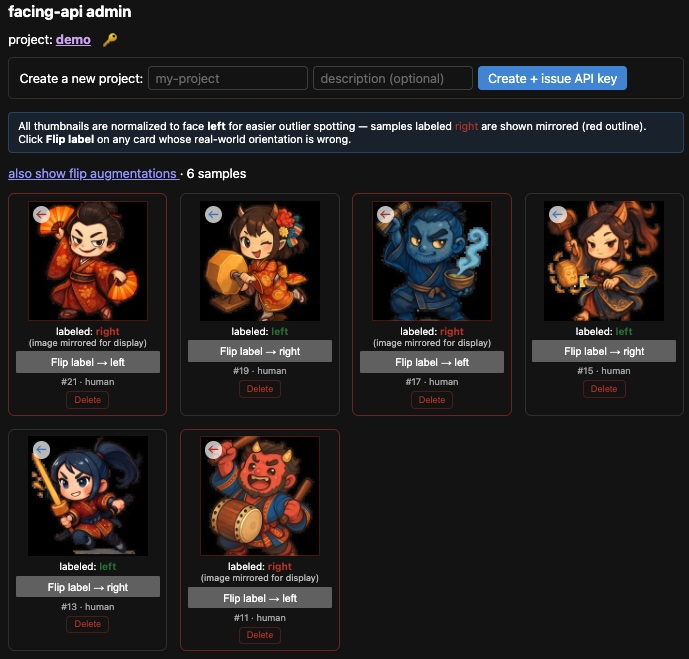

# image-facing-api

An HTTP microservice that predicts a **full annotation** for a single-subject
image: **facing** (`left` / `right`) plus **zoom_up** (boolean — “show a bit
larger”; the client applies a fixed factor such as ×1.2. Wings/horns/etc. are
not modeled). One label space, one k-NN neighbor set.

Originally built for **AI-generated character cutouts** (transparent /
plain-background, one subject), which is the case it works best on out of the
box.

It is not restricted to that use case, but **the input is assumed to be an
isolated single subject**. Busy backgrounds drag the DINOv2 embedding toward
the scene rather than the subject, so k-NN accuracy drops. Photographs can
work too if you preprocess them the same way — cut the subject out (rembg /
SAM / etc.) before sending, keep one subject category per `project`, and feed
enough labels for k-NN to settle.

## What it does

- Send an image, get back `{ facing, zoom_up, confidence }`
  (`POST /v1/{project}/predict`).
- Send a ground-truth full annotation; it joins the training set immediately
  (`POST /v1/{project}/label`).
- The admin UI lets you correct facing / zoom_up by hand (**human-in-the-loop**).

## Design in three lines

- **Embeddings + k-NN.** DINOv2 **ViT-B/14** (768-dim ONNX, CPU) embeds each
  image; prediction is majority vote for both facing and zoom_up over the same
  neighbors. No end-to-end CNN training — **small data, CPU, instant updates**.
- **Adding a label = instant learning.** k-NN just appends one vector to the
  neighbor set — no retraining step.
- **Per-project label spaces** (multi-tenant). Illustration projects and
  photo projects never mix labels.

## Documentation

**The source of truth for design and spec lives under [`docs/`](docs/README.md).**
Start with [`docs/README.md`](docs/README.md). This repository is
**docs-first**: implementation follows the docs, not the other way around.

## Screenshots

| Playground (`/playground`) | Admin (`/admin`) |
| --- | --- |
|  |  |

## Try it in a browser

A zero-build playground UI is served by the API itself at **`GET /playground`**.

```bash
cp .env.example .env             # edit ADMIN_USER / ADMIN_PASS to taste
uv sync
uv run uvicorn app.main:app --reload
```

`.env` is loaded automatically on startup (existing env vars are not
overridden, so it is transparent on Railway etc.).

First-time flow:

1. Open `http://localhost:8000/admin` and authenticate with the
   `ADMIN_USER` / `ADMIN_PASS` from your `.env`.
2. Use the **"Create a new project"** form at the top of the page. The
   response shows the **plaintext API key exactly once** — copy it.
3. Open `http://localhost:8000/playground`, paste the project name and the
   API key, and drop an image.

Without a DINOv2 ONNX model file, `predict` / `label` return 503, but the
pages themselves and project creation work fine.

## Stack

Python 3.12 / FastAPI / uvicorn / onnxruntime (DINOv2 ONNX, CPU) / SQLite / Railway.
See [docs/architecture.md](docs/architecture.md) for details.

## License

The code in this repository is licensed under the [MIT License](LICENSE).

The embedding model is Meta's [DINOv2](https://github.com/facebookresearch/dinov2)
(ViT-B/14 by default), exported to ONNX. **DINOv2 itself is licensed under Apache 2.0** —
see the upstream repository for the authoritative terms. Users of this service
must also comply with the upstream model license.

Export locally: `python scripts/export_dinov2_onnx.py --model dinov2_vitb14`.
Speed check: `python scripts/bench_embed.py`.
